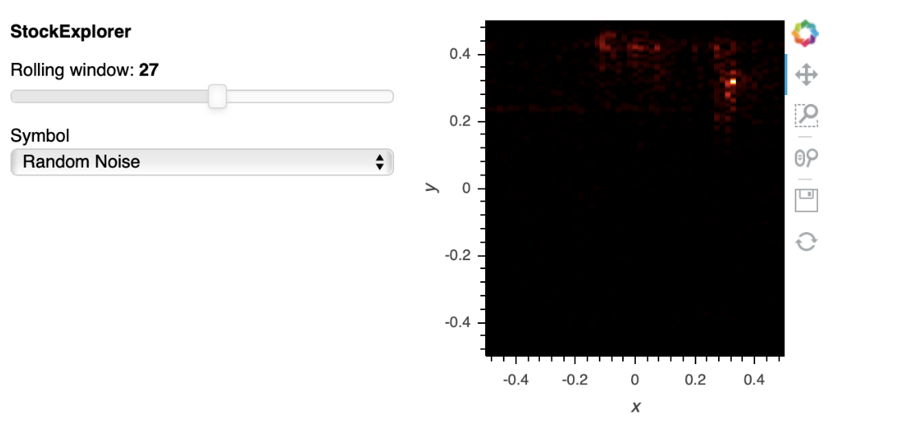
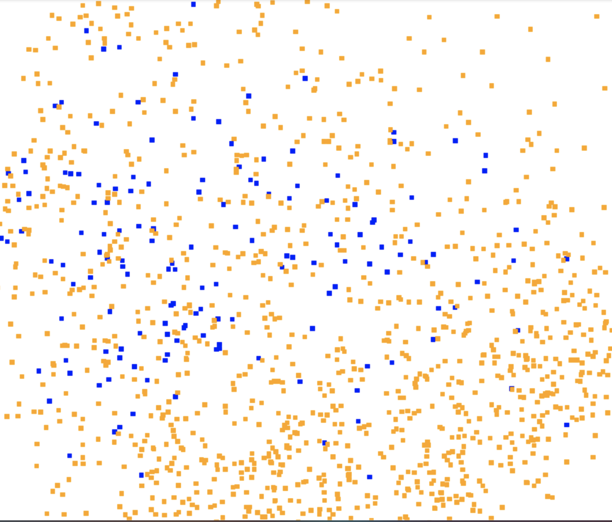
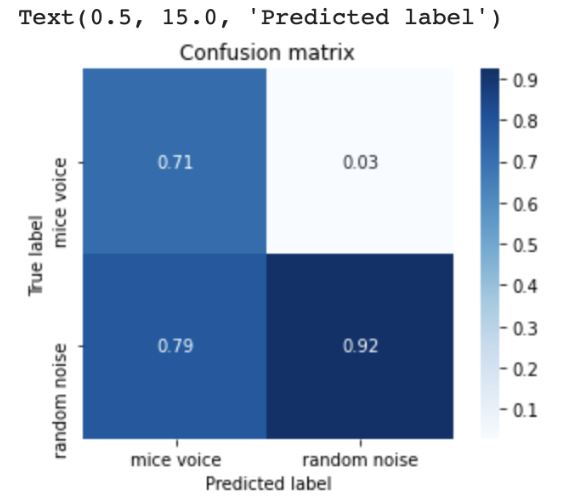

# New jupyter notebooks

Note: The following notebooks use specific data files in the USV Shared Drive

Detailed explanition of all the notebooks and the order in which they need to be seen is specified below.

Link to all the data files that are used in these notebooks -
https://drive.google.com/drive/folders/1_y0bo4ju76764ua5MwWs5E5toN5YbJiO?usp=sharing

In the following research we are using the VGGish model to analyse the sounds generated by mice and then classifying them into varied feeling(fear, pain, etc) that the mice posses at different times.

Jupyter notebooks -

1. Git-vs-VGG-spectrogram - The following jupyter notebooks compares the spectrograms that are made using VGGish model and the ones that are made using scipy spectrogram function(named it Git becuause one of our collaborators used it previosuly which is now available on GitHub). With this we came to a conclusion that the spectograms made by the scipy function gave better results.

2. Interpolated Spectrogram - The data in the NetCDF file is of the form (26666, 55, 257). Where 55 represents the time stamps and 257 represents the frequency stamps. In order for this data to be used by the VGGish model we need to convert it in the form of (?, 96, 64). Where 96 represent the time stamps and 64 represents the frequency stamps. This notebook explains how to convert the data from the netCDF format to the numpy format so that it can be used by the VGGish model.

3. Netcdf-to-numpy(no-rand) - The following file reads a specified csv file that has the information like - experiment, animan number, time stamps. The notebook then looks at that particular time stamp in the specified NetCDF file. It then changes its shape so that it can be used by the VGGish model and then stores it in a numpy file called - annot_df_CPApost_round2_data.npy

4. Netcdf-to-numpy - The following file does the same thing that the previous file does but with one extra feature. It now works with two numpy arrays. It stores the data of the mice sound in one and the random noise in the another. We later use there files to plot the cluster plot and the interactive plots.

5. Mice-Noise-Visualization - This file works with the numpy files for the mice sound and random noise that were generated in the above jupyter notebook. The notebook uses holoviews to allow the user to select the category they want to observe(mice sounds or random sound) and then scroll through multiple spectogrograms for each category to understand the difference between the different categories of sound.

6. tf-record-generator - In order to plot the cluster plot it is important to extract the tf-records(they provide us with the location of the spectrogram). This file shows how to generate the tf-records for a numpy file that has been generated before.

6. tf-record-generator-vggish-model - In order to plot the cluster plot it is important to extract the tf-records(they provide us with the location of the spectrogram). This file shows how to generate the tf-records for a numpy file that has been generated before. For this file, the checkpoints that were originally used by the vggish model are used initially during the training. 

7. Cluster Plot - Most simple cluster plot that plots 6 sounds generated by mice and 6 random noise together to see if the matplotlib offsetbox is able to distinguish between them. The following code used the tf-records and the numpy array for the offsetbox plot.

8. Cluster-plot-netcdf-file - Since the previos plot plotted just 12 spectrograms in total we needed more data points to really appreciate the clustering. To take that into consideration this notebooks incorporated data from one selection table that has 1790 data points. It then plots the cluster plot. Since plotting all the spectograms does not help us in identifying the type of sound that it plots. So instead of showing the spectorograms, it shows small squared boxes where different colors represent different types of sound plotted(mice - BBC, low slug, etc and random noise). 

9. trainingVGGISH - This notebook is used to train the numpy data that has been generated from the selection table in the notebook Netcdf-to-numpy. The notebook defines the tensorflow model that uses the cross entropy function for minimizing the loss and the Adam optimizer for the training. The notebook only calculated the loss for 10 batch trainings. The notebook, however, does not plot the confusion matrix and the ROC curve to let us evaluate the performance of the model that we made.

10. Single-prediction-training - The following notebook is used to train the model with the dataset that was being used in the previous notebook. But this time the notebook also calculates the accurancy of the model. It also plots the confusion matrix based on the testing done on a dataset of about 150 data points(10 percent).

11.  two-dataset-prediction-training - Since the results in the previous training were not the best we though that maybe testing the model with more data will imporove the performance of the model. Now, this files takes into account 2 datasets. So the total number of data-points are about 3700. The notebook also plots the ROC curve for the trained model for both the prediction classes.

12. wav-to-numpy(forVggFeed) - now that we have trained our model, it was necessary to check how well it predicted the mice data. So for this I made this notebook where the notebook first converts a wav file into numpy data. Once the numpy data is made, all the data is fed into the model that we just trained and compared the results that we get from the model with the ones that we have stored in the selection table. We found out that the model predicted a lot of extra mice sounds. We suspect that as the sound increased, the model identified it to be a mice sound. So from this we understand that the model that we have trained right now does not do a great job. In order to improve the model, more random noise had to be fed to it so that it understands the difference between random noise and mice sounds. 

13. Checkpoint-review - since from the previous notebook we understood that the model does not predict the mice sounds correctly we need to train it a little more. Since we cannot train the model in a single go, we need to do it in parts. For this, after each training we do we store the results in checkpoints. The following notebook is used as a dummy example of how to restore a model from the checkpoint and continue training on it. 

14. Cross-validation-training - Since we understood that we need to train the model more on random noise, I made this notebook. In this notebook, I prepare data that needs to be fed to the model. For this, I selected a wav file, converted it into numpy data. Then based on the timings that represent the mice data in the selection table, I separate the data that represents mice data. Towards the end I have two numpy arrays - onee that represnts mice data(approx 700) and the other that represents random sounds(13542). Once these numpy arrays are ready, I feed combination of 500 random noise and 500 mice sounds to the model. This is done so that the more random noise is supplied to the model. 

Note - Once the wav-to-numpy(forVggFeed) is run again on the newly trained model the peerformace of the model is much better. Now only 98 times are identified to be micee sounds compared to the the 500 mice sounds predicteed in the previous model.

